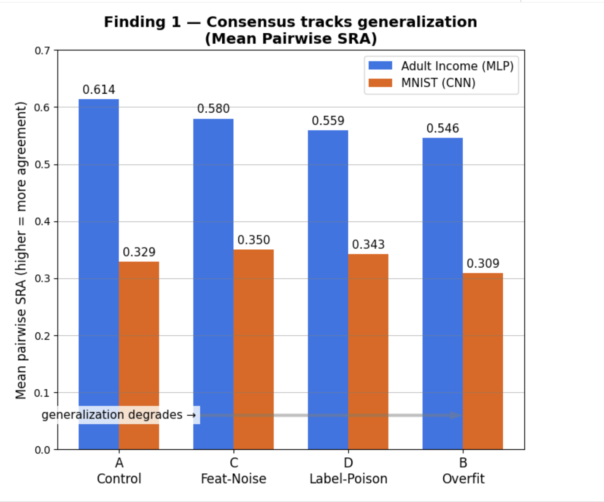
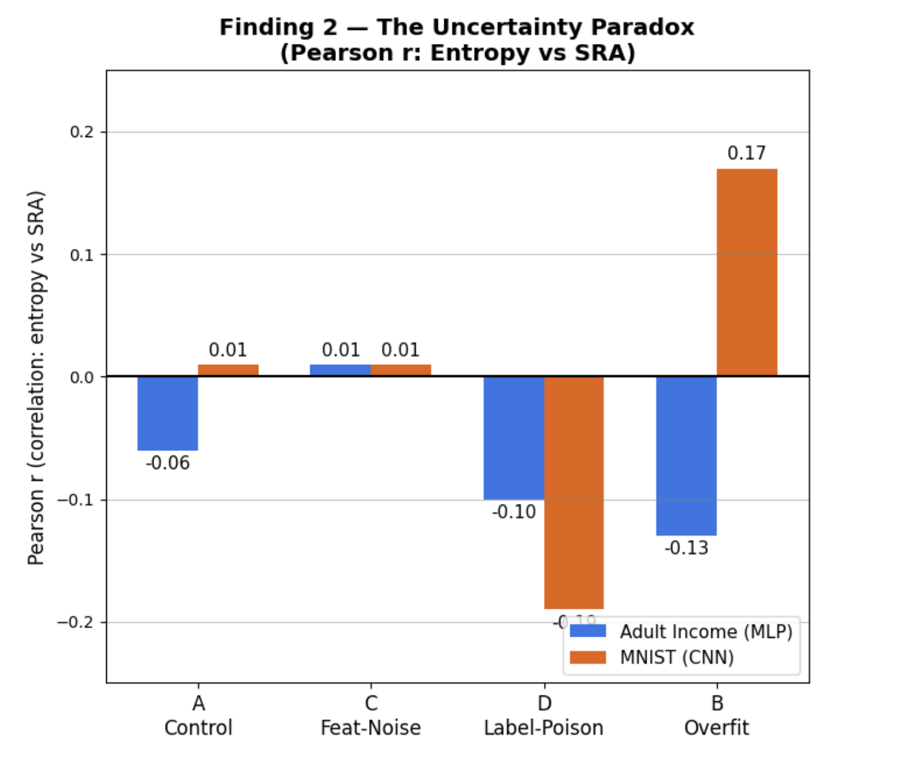
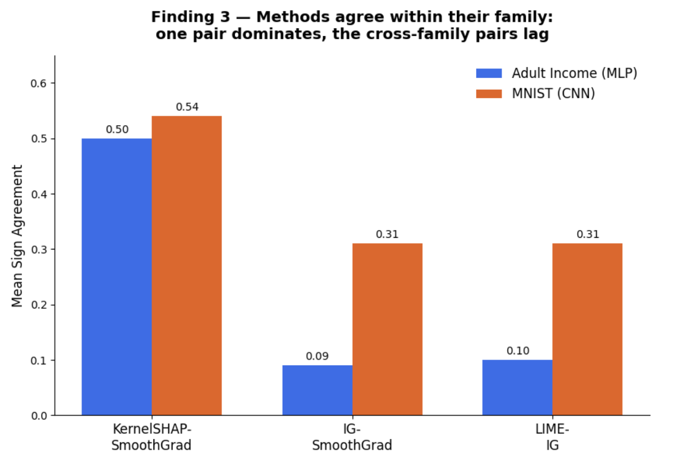

# The Disagreement Problem in Explainable ML

Research code for **"The Disagreement Problem: How Model Generalization
Impacts XAI Consensus"**
(Kowel P Laloo · Chitiveli Hemcharan Varma · advisor Prof. Manisha Padala,
Dept. of CSE, IIT Gandhinagar).

We ask a question the original disagreement literature leaves open: is XAI
disagreement only a property of the *explanation methods*, or also a symptom of
**model quality**? We build a from-scratch framework, run it across a
generalization spectrum on two datasets, and report what we find.

The work is layered on top of the framework introduced by:

> Krishna, Han, Gu, Wu, Jabbari, Lakkaraju (2024).
> *The Disagreement Problem in Explainable Machine Learning: A Practitioner's
> Perspective.* Transactions on Machine Learning Research.

Our poster lives alongside the code:
[`xai_disagreement_poster (1).pdf`](./xai_disagreement_poster%20(1).pdf).

---

## What's here

```
xai_disagreement/        Shared core library (the disagreement framework)
  metrics.py             6 base metrics + weighted rank agr. + our RA/SA/SRA + entropy
  explainers.py          LIME, KernelSHAP, VanillaGrad, Grad*Input, IG, SmoothGrad
  alignment.py           project every attribution onto one shared index space
  aggregate.py           average metrics over method pairs and instances
  findings.py            the 3 findings as reusable analysis + plots

paper_reproduction/      Framework check on COMPAS (6 methods, 6 metrics)
adult_income_study/      OUR main study: UCI Adult Income + 4 MLPs  (the poster)
mnist_cnn_study/         OUR extension: MNIST + a basic CNN

docs/method_notes.md     Formal definitions of every metric
```

We build the framework first (`xai_disagreement/`), sanity-check it on COMPAS
(`paper_reproduction/`), then run our own research — `adult_income_study/` is the
headline study, `mnist_cnn_study/` extends it to images.

---

## Setup

The repo is self-contained — LIME, KernelSHAP and the gradient methods are all
implemented from scratch, so no `lime`/`shap`/`captum` is required.

```bash
python -m venv .venv && source .venv/bin/activate
pip install -r requirements.txt
```

> A `.venv/` built with `numpy<2` already exists in this folder; the global
> Anaconda environment on this machine has a broken numpy 1.x/2.x ABI mix and is
> **not** used.

---

## Run

```bash
# 1. Framework check (COMPAS, 6 methods, 6 metrics -> heatmaps)
python -m paper_reproduction.run_disagreement

# 2. Main study (Adult Income, 4 MLP variants, 3 findings)
python -m adult_income_study.run_all              # add --quick for a fast smoke run

# 3. Extension (MNIST + CNN, 3 findings)
python -m mnist_cnn_study.run_all                 # add --quick for a fast smoke run
```

Each writes PNG figures + a `results.json` to its own `figures/` folder.

---

## The study in one paragraph

Prior work treats XAI disagreement as a mathematical artifact of the *methods*.
Our hypothesis: it is also a symptom of **model quality** — poorly generalizing
models produce unreliable gradient landscapes that amplify or mask inter-method
divergence. We train one architecture four ways across a generalization
spectrum — **A** Control · **C** Feature-Noise · **D** Label-Poison · **B**
Overfit — apply four XAI methods (LIME, KernelSHAP, IG, SmoothGrad) all
projected onto the same feature indices, and measure pairwise Rank Agreement
(RA), Sign Agreement (SA) and Signed Rank Agreement (SRA, primary).

---

## Results

**Bottom line:** across two datasets, model quality leaves a measurable mark on
XAI consensus, but it is a weak signal — agreement drifts down as a model
overfits, "more agreement" does not mean "better explanation," and methods split
into families that agree with their own kind. Details below.

### Models trained (accuracy / generalization gap)

**Adult Income (MLP), k = 10**

| Variant | Train acc | Test acc | Gen. gap |
|---|---|---|---|
| A — Control | 0.884 | 0.836 | 0.048 |
| C — Feature-Noise | 0.785 | 0.755 | 0.031 |
| D — Label-Poison | 0.783 | 0.705 | 0.077 |
| B — Overfit | 0.658 | 0.630 | 0.029 |

**MNIST (CNN), k = 8**

| Variant | Train acc | Test acc | Gen. gap |
|---|---|---|---|
| A — Control | 0.974 | 0.963 | 0.011 |
| C — Feature-Noise | 0.929 | 0.933 | −0.004 |
| D — Label-Poison | 0.965 | 0.957 | 0.008 |
| B — Overfit | 0.961 | 0.958 | 0.003 |

*In short:* on Adult Income the Label-Poison model (D) shows the largest
train/test gap (0.077) and the Overfit model (B) the smallest (0.029) — with the
current corruption levels the gap ordering isn't the clean A < C < D < B the
design intended. On MNIST even the "overfit" CNN generalizes well, so every gap is
tiny — which is why the MNIST effects below come out smaller.

### Finding 1 — Consensus tracks generalization

Mean pairwise SRA is lowest for the overfit model (B) on both datasets, and
highest for the well-generalizing control on Adult (on MNIST the feature-noise
variant C edges out the control).

| Variant | Adult SRA | MNIST SRA |
|---|---|---|
| A — Control | 0.614 | 0.329 |
| C — Feature-Noise | 0.580 | 0.350 |
| D — Label-Poison | 0.559 | 0.343 |
| B — Overfit | 0.546 | 0.309 |



Control → Overfit SRA decline: **11.2%** (Adult), **6.1%** (MNIST). On Adult the
decline is clean and monotonic (A > C > D > B); on MNIST it is modest and not
strictly monotonic — the feature-noise variant (C) edges out the control, which
we read as label noise hurting consensus more than input noise.

*In short:* explanation methods agree most on a healthy model and least on an
overfit one — evidence that disagreement is partly about the model, not just the
methods.

### Finding 2 — The Uncertainty Paradox

Predictive entropy and SRA are *not* consistently positively correlated;
degraded models give flat, near-zero attributions, so methods can trivially
"agree on nothing." Pearson r (entropy vs SRA):

| Variant | Adult | MNIST |
|---|---|---|
| A | −0.06 | 0.01 |
| C | 0.01 | 0.01 |
| D | −0.10 | −0.19 |
| B | −0.13 | 0.17 |



The sign flips across variants — high agreement is not evidence of an
informative explanation.

*In short:* a degraded model can make methods "agree" simply because all their
attributions collapse toward zero. Consensus can be a sign of a broken model, not
a trustworthy one.

### Finding 3 — Family-structured disagreement

Sign Agreement is dominated by a single pairing on both datasets — but a
different pair each time: on Adult the two gradient methods IG and SmoothGrad
agree almost perfectly (~0.96), while on MNIST KernelSHAP and SmoothGrad lead
(~0.54). Either way one pair sits far above the cross-pairs.

| Pair (mean SA) | Adult | MNIST |
|---|---|---|
| IG–SmoothGrad | ~0.96 | ~0.31 |
| KernelSHAP–SmoothGrad | ~0.07 | ~0.54 |
| LIME–IG | ~0.09 | ~0.31 |



On COMPAS the framework check shows the same family structure: gradient methods
cluster tightly (Grad–SmoothGrad SRA 0.60) and LIME–KernelSHAP cluster (SRA
0.52), confirming the metric implementations behave as expected before we apply
them to our own models.

*In short:* the strongest agreement on Adult is between two gradient methods
(IG, SmoothGrad), consistent with a same-family effect; MNIST is messier. Either
way, high within-pair agreement reflects shared assumptions, not proof that the
explanation is correct.

---

## Notes on method

LIME, KernelSHAP and the gradient explainers are implemented from scratch, so
absolute metric values depend on our samplers and seeds rather than any external
library. Everything in the Results section is computed from freshly trained
models; rerunning `*.run_all` regenerates every figure and `results.json`. See
[`docs/method_notes.md`](docs/method_notes.md) for exact metric definitions and
the one adaptation we make to the SRA formula.
